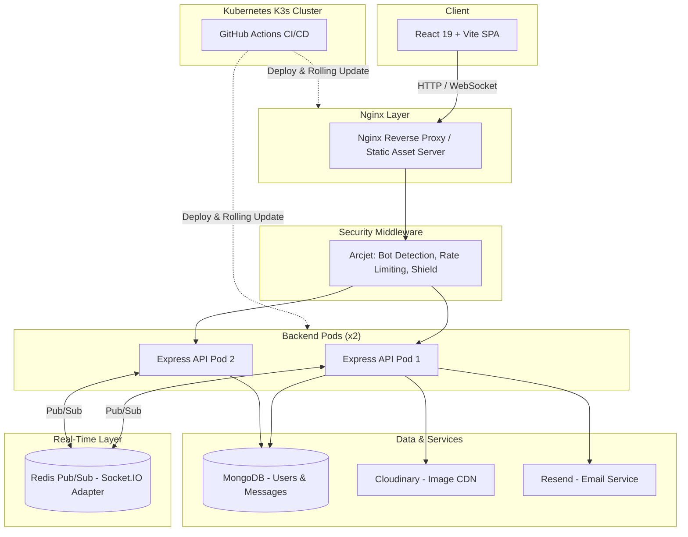
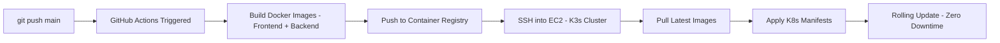

# FlashChat

**Real-Time Chat Application with Glassmorphism UI and Cloud-Native Deployment**

FlashChat is a full-stack, real-time chat web application combining a modern glassmorphism interface, robust security policies, horizontal scaling capabilities, and an automated GitOps deployment pipeline.

---

## Overview

FlashChat enables instant, secure messaging between users with a premium visual experience. The application is built to be production-ready and Kubernetes-native, with built-in protection against bots, SQL injection, and abuse, alongside a real-time architecture that scales horizontally across multiple pods using Redis.

---

## Features

**User Interface**
- Glassmorphism design language with cursor-parallax backgrounds
- Floating canvas particles and ambient animations
- Smooth shimmer and entry transitions

**Real-Time Messaging**
- Instant message delivery via Socket.IO
- Online/offline presence indicators
- Inline message editing and deletion with confirmation
- Messages grouped and displayed by day

**Security**
- Arcjet bot detection and SQL injection / XSS shielding
- Sliding window rate limiting (100 requests per 60 seconds per IP)
- JWT cookie-based authentication
- BcryptJS password hashing

**Scalability & Deployment**
- Kubernetes (K3s) deployment with multi-replica services
- Redis-backed Socket.IO adapter for cross-pod real-time sync
- Automated CI/CD pipeline via GitHub Actions
- Nginx reverse proxy and static asset serving

---

## Tech Stack

| Layer | Technologies |
|---|---|
| **Frontend** | React 19, React Router v7, Zustand, TailwindCSS, DaisyUI, Axios, Socket.IO Client, Lucide React, Emoji Picker |
| **Backend** | Node.js, Express, Socket.IO, MongoDB, Mongoose, JWT, BcryptJS |
| **Security** | Arcjet (Rate Limiting, Bot Detection, SQL Injection Shielding) |
| **Cloud & Integrations** | Cloudinary (Image Uploads), Resend (Transactional Emails) |
| **DevOps** | Docker, Nginx, Kubernetes (K3s), GitHub Actions |
| **Scaling** | Redis (Socket.IO Adapter for WebSocket clustering) |

---

## Architecture



---

## Project Structure

```
FlashChat/
├── package.json              # Monorepo install/build scripts
├── docker-compose.yml         # Local multi-container setup
│
├── Backend/
│   ├── server.js                # Entry point — routes + static serving
│   ├── models/
│   │   ├── User.js               # User schema (profiles, encrypted passwords)
│   │   └── Message.js            # Message schema (text + Cloudinary links)
│   ├── controllers/
│   │   ├── auth.controller.js    # Signup, login, logout, profile updates
│   │   └── message.controller.js # Send, edit, delete, sort conversations
│   ├── middleware/
│   │   ├── auth.middleware.js        # Cookie-based JWT verification
│   │   ├── socket.auth.middleware.js # Socket.IO handshake auth
│   │   └── arcjet.middleware.js      # Security rules engine
│   ├── lib/
│   │   ├── socket.js              # Real-time event hub + Redis adapter
│   │   ├── arcjet.js               # Shield, Bot Detection, Rate Limiter config
│   │   ├── cloudinary.js           # Cloudinary SDK wrapper
│   │   ├── resend.js                # Email service config
│   │   ├── emailHandlers.js         # Welcome email logic
│   │   ├── emailTemplates.js        # Styled email templates
│   │   └── db.js                    # MongoDB connection
│   └── Dockerfile               # Alpine Node.js runtime
│
├── Frontend/
│   ├── src/
│   │   ├── App.jsx                  # Router + protected routes
│   │   ├── pages/
│   │   │   ├── Login.jsx            # Glassmorphism login screen
│   │   │   ├── SignUp.jsx           # Glassmorphism signup screen
│   │   │   └── Chatpage.jsx         # Core chat interface
│   │   ├── store/
│   │   │   ├── useAuthStore.js      # Auth state + socket lifecycle
│   │   │   └── useChatStore.js      # Messages, contacts, real-time sync
│   │   └── index.css                 # Brand colors, glows, animations
│   ├── Dockerfile                 # Multi-stage: Node build → Nginx serve
│   └── nginx.conf                  # Static serving + API/socket proxy
│
└── k8s/ & .github/
    ├── namespace.yml
    ├── redis-deployment.yaml / redis-service.yaml
    ├── backend-deployment.yaml / backend-service.yaml
    ├── frontend-deployment.yaml / frontend-service.yaml
    ├── ingress.yaml                  # Traefik routing rules
    └── workflows/deploy.yml          # CI/CD: build → push → SSH → rollout
```

---

## Key Workflows

### Security-First Request Pipeline

Every request passes through `arcjet.middleware.js` before reaching controllers:

- **Shield Protection** — SQL injection and XSS shielding via `shield({ mode: "LIVE" })`
- **Bot Detection** — Filters malicious client agents and bot categories
- **Rate Limiting** — Sliding window cap of 100 requests per 60 seconds per IP

### Horizontally Scalable Real-Time Sync

Socket.IO normally requires sticky sessions when scaled — FlashChat solves this with Redis:

```
Pod A (User 1 connected) ──┐
                            ├──► Redis Pub/Sub ──► Broadcast to all pods
Pod B (User 2 connected) ──┘
```

When `REDIS_URL` is configured (e.g., inside Kubernetes), the `@socket.io/redis-adapter` links all replica pods, ensuring messages reach users regardless of which pod they are connected to.

### Client-Side State Management (Zustand)

| Store | Responsibility |
|---|---|
| `useAuthStore` | Tracks `authUser`, handles login/verification, manages socket connect/disconnect |
| `useChatStore` | Manages contacts, message lists, real-time subscriptions, and conversation ordering |

When a new message arrives via `subscribeToMessages()`:
- If from the active chat partner, it is instantly rendered in the thread
- If from another user, the unread badge is incremented
- The conversation list is re-sorted so the newest message moves to the top

---

## CI/CD Pipeline



---

## Roadmap

- [ ] Groups Tab — Multi-user group chats (currently a "Coming Soon" placeholder)
- [ ] Theme Selection — Light/Dark mode toggle in Appearance Settings
- [ ] Voice/Video calling integration
- [ ] Message pinning and starred messages
- [ ] Global search across conversations

---

## Getting Started

```bash
# Clone the repository
git clone https://github.com/yourusername/flashchat.git
cd flashchat

# Run with Docker Compose
docker-compose up --build

# Frontend: http://localhost:5173
# Backend:  http://localhost:5001
```
